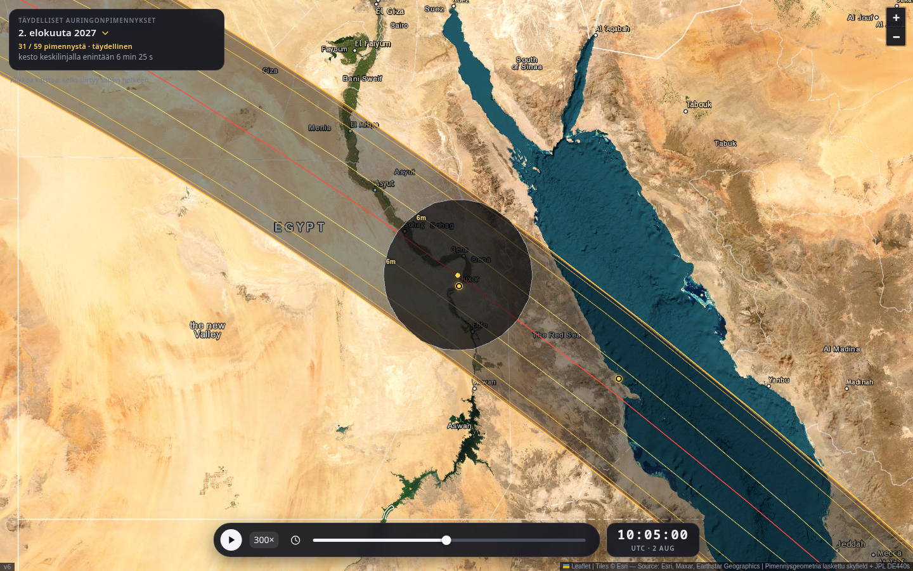

# Eclipse map — every total solar eclipse, 1986–2066

Interactive map of **59 total and hybrid solar eclipses** between 1986 and 2066,
opening on the **total eclipse of August 2, 2027** — the longest land totality
of the 21st century (6 min 23 s near Luxor, Egypt).

Everything is computed from scratch: the only external input is NASA JPL's
DE440s ephemeris. The eclipse list itself is derived from the ephemeris too —
no published catalogues, no external path data. Published predictions are used
only to *check* the result (see Validation).



## Features

- Slippy satellite map (Leaflet + Esri World Imagery), zoom & pan
- Eclipse picker: 59 eclipses, 1986–2066, each loaded on demand
- Path of totality: northern/southern limits, center line, duration contours
  (1 / 2 / 4 / 6 minutes)
- Animated umbra moving along its true track at true speed — video-style
  controls: play/pause, speed multiplier, time slider, UTC clock
- Click anywhere: jumps the clock to when the shadow is closest, and reports
  local totality duration and time of maximum inside the path
- Nine observing sites around the 2027 path with full local circumstances
- Keyboard: space = play/pause, arrow keys = step one minute

## Run it

```bash
python3 -m venv .venv && .venv/bin/pip install numpy skyfield

# the default eclipse (~9 s; downloads de440s.bsp, ~32 MB, on first run)
.venv/bin/python gen_data.py

# the whole 1986-2066 catalogue: ~20 s to discover, ~5 min to generate
.venv/bin/python find_eclipses.py    # -> data/index.json (59 eclipses)
.venv/bin/python gen_data.py --all   # -> data/eclipses/YYYY-MM-DD.js (10.5 MB)
```

Then open `web/index.html` directly in a browser, or serve it **from the repo
root** (not from `web/`, which cannot reach `../data/`):

```bash
python3 -m http.server 8000    # -> http://localhost:8000/web/
```

## How it works

A point on Earth is inside the umbra at time *t* when, as seen from that
point, *separation(Sun, Moon) + angular radius of Sun < angular radius of
Moon* (and the Sun is above the horizon). This observer-based criterion is
evaluated on numpy grids: a coarse global sweep finds the track, a local
refinement (60 s steps) traces the umbra outline with 60 radial rays, and
cross-track duration profiles yield the path limits and duration contours.

Finding *which* eclipses exist uses the same criterion at a single well-chosen
point. The shadow axis runs from the Sun's centre through the Moon's centre;
where it meets the ellipsoid the shadow is deepest, so one observer standing
there settles it — total if the Moon's apparent radius wins, annular if the
Sun's does, hybrid if both happen along the track. That matters: a lat/lon grid
coarse enough to sweep 80 years steps straight over the few-kilometre umbra of
a barely-total hybrid. Four of the 59 are exactly that case; the shortest,
1986-10-03, is total for **two seconds**.

Two optimizations make the full computation run in ~9 seconds: apparent
Sun/Moon positions are evaluated once per time step from the geocenter (the
topocentric correction is then a vector subtraction, cross-validated against
skyfield's full pipeline to < 0.02″), and the ITRS→GCRS rotation matrix is
hoisted out of the per-point loop.

## Validation

| checkpoint | computed | published |
|---|---|---|
| Path start | 08:25 UTC, Atlantic | ✓ |
| Strait of Gibraltar | 08:48 UTC | ✓ |
| Luxor | 10:02–10:08 UTC, 6 min 23 s | ✓ |
| Maximum duration | 6 min 25 s | ~6 min 23 s (Δ from mean lunar limb) |
| Path end | 11:49 UTC, Indian Ocean | ✓ |

Durations run ~2 s long versus published predictions. That is the lunar-radius
convention, and it was measured rather than assumed: duration changes by 3 s
per km of assumed lunar radius, and Espenak's table is reproduced at
R_moon ≈ 1736.6 km, against the IAU mean radius of 1737.4 km used here.

`check_oracle.py` compares 17 points along the 2027 centre line against
[NASA/GSFC's published path table](https://eclipse.gsfc.nasa.gov/SEpath/SEpath2001/SE2027Aug02Tpath.html)
(Espenak): durations agree to +1.4…+2.1 s, times of maximum to +3.5…+5.0 s, and
the path width to +1.8…+2.8 km of ~250 km. The catalogue is checked against
known eclipses too — 2017-08-21 at 162.5 s vs 160.2 s published, 2024-04-08 at
270.1 s vs 268.1 s, and 2009-07-22 confirmed as the longest of the century.

Acceptance tests (`check.py`, Playwright + headless Chromium):

```bash
.venv/bin/pip install playwright && .venv/bin/playwright install chromium
.venv/bin/python check.py
```

## Files

```
eclipse_core.py        shared physics: umbra criterion, SkyTable, shadow axis
find_eclipses.py       discovers every total/hybrid eclipse, 1986-2066
gen_data.py            data generator (numpy + skyfield)
check.py               browser acceptance tests (45 checks)
check_oracle.py        comparison against published predictions (7 checks)
data/index.json        the catalogue: 59 eclipses
data/eclipses/*.js     one lazy-loaded file per eclipse (10.5 MB total)
web/                   the page (Leaflet from CDN, no build step)
```

Map tiles © Esri. Ephemeris: JPL DE440s. Reference predictions for validation: NASA/GSFC (Fred Espenak).
